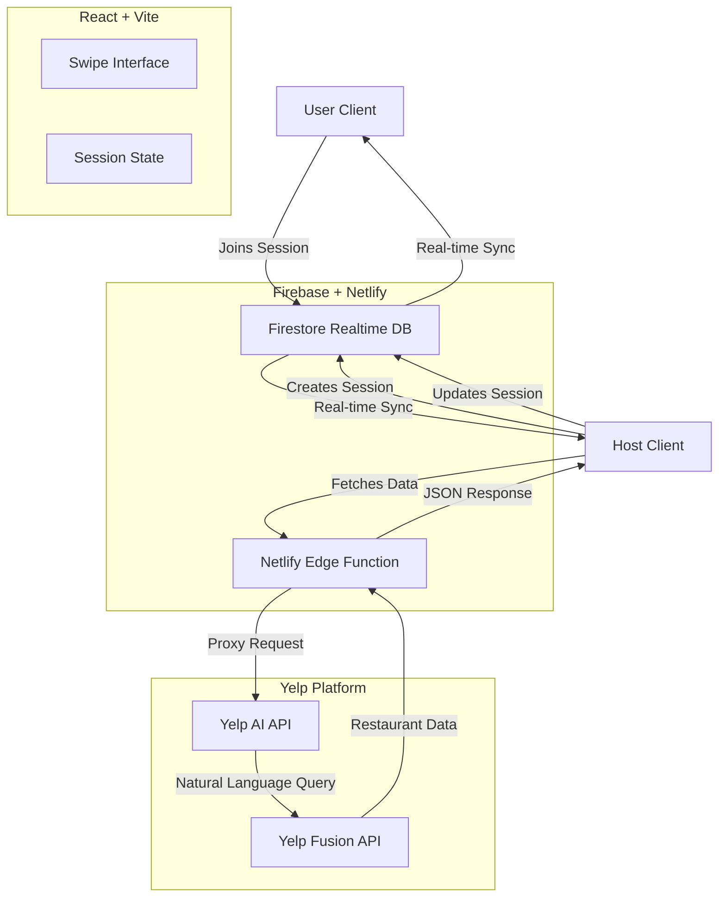

# GroupTable

**Group-first dining planning powered by Yelp AI.**

GroupTable (formerly YelpMatch) solves the "where should we eat?" dilemma by combining a Tinder-like swipe interface with real-time group collaboration and Yelp's powerful AI recommendations.

🔗 **[Live Demo](https://fabulous-smakager-c0d743.netlify.app/)**


## 📖 Overview

Planning a group dinner is often a messy process of endless text threads, indecision, and "I don't know, what do you want?" responses. GroupTable streamlines this into a fun, interactive game:

1.  **Host** starts a session with preferences (Cuisine, Location, Price, Time).
2.  **Friends** join via a shared link.
3.  **Everyone Swipes** on a curated list of restaurants powered by Yelp AI.
4.  **It's a Match!** The group is instantly notified when a consensus is reached.

Unlike standard restaurant finders, GroupTable uses **Yelp's AI API** to understand natural language dietary restrictions (e.g., "Gluten-free friendly but good for meat eaters") and fetch highly relevant options.

## ✨ Key Features

-   **Real-Time Collaboration**: Watch friends join the lobby and see live status updates.
-   **AI-Powered Recommendations**: Uses Yelp's AI to interpret complex dietary needs and preferences.
-   **Swipe-to-Vote**: Intuitive "Right for Yes, Left for No" interface.
-   **Smart Consensus**: Automatically detects when the group has matched on a restaurant.
-   **Host Controls**: The host can "Load More" options if the group runs out, or force a decision.
-   **Dietary Inclusivity**: Explicit support for Vegan, Vegetarian, Gluten-Free, Halal, and more.
-   **Native Feel**: Built with Framer Motion for smooth, app-like animations on the web.

## 🏗️ Architecture

GroupTable is built on a modern serverless stack, ensuring low latency and high scalability.



### Data Flow
1.  **Session Creation**: The host creates a document in Firestore with configuration and filters.
2.  **Restaurant Fetching**: The host's client calls a secure Netlify serverless function.
3.  **AI Processing**: The function calls Yelp's AI API, passing natural language dietary preferences (e.g., "Vegan and Gluten-Free options").
4.  **Real-time Sync**: As users swipe, votes are recorded in Firestore. Listeners on all clients trigger the "Match" state instantly when a threshold is reached.

## 🛠️ Tech Stack

-   **Frontend**: React, TypeScript, Vite
-   **Styling**: Tailwind CSS, Lucide React
-   **State/Backend**: Firebase (Firestore)
-   **Animations**: Framer Motion
-   **API Integration**: Yelp Fusion AI API
-   **Deployment**: Netlify (Frontend + Serverless Functions)

## 📸 Screenshots

| Landing Page | Preferences |
|:---:|:---:|
|  |  |

| Session Lobby | Invite |
|:---:|:---:|
|  |  |

| Swipe Interface | Match Screen |
|:---:|:---:|
|  |  |

## 🚀 Getting Started

### Prerequisites

-   Node.js (v18+)
-   Yelp Fusion API Key

### Installation

1.  **Clone the repository**
    ```bash
    git clone https://github.com/v7h-lab/FullSend.git
    cd FullSend
    ```

2.  **Install dependencies**
    ```bash
    npm install
    ```

3.  **Environment Setup**
    Create a `.env` file:
    ```env
    VITE_YELP_API_KEY=your_key_here  # For local dev only
    ```

4.  **Run Locally**
    ```bash
    npm run dev
    ```

### Production Deployment

For production, we use Netlify Functions to hide the API key.

1.  Deploy to Netlify.
2.  Set `YELP_API_KEY` in Netlify Environment Variables.
3.  The app automatically switches to using `/.netlify/functions/yelp-proxy` in production.

## 🤝 Contributing

Contributions are welcome! Please read our [Contributing Guide](CONTRIBUTING.md) for details on our code of conduct and the process for submitting pull requests.

## 📄 License

This project is licensed under the MIT License - see the [LICENSE](LICENSE) file for details.

---
*Built for the Yelp AI API Hackathon*